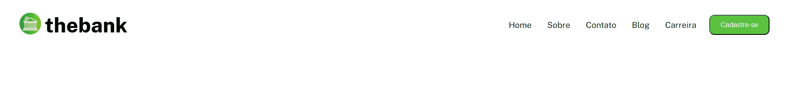

## Guia

- [Visão geral](#visão-geral)
  - [Funcionamento](#funcionamento)
  - [Aparência](#aparência)
  - [Links](#links)
- [Processo](#processo)
  - [Desenvolvido com](#desenvolvido-com)
  - [Aprendizado](#aprendizado)

## Visão geral

### Funcionamento

O usuário deve ser capaz de:

- Ver o layout ideal para o menu, dependendo do tamanho da tela do dispositivo
- Deve aver quebra de linhas no mobile

### Aparência

### Links

- Live Site URL: ( https://welington1209.github.io/desafio-flexbox-menu/ )

## Processo

### Desenvolvido com:

- Tag's semânticas de HTML
- Propriedades de estilização de CSS
- Flexbox
- Responsividade

### Aprendizado

Neste projeto minha maior dificuldadde foi fazer a parte responsiva.
